[TOC]

# 创建用户

http://172.18.32.138:3030/Create/User

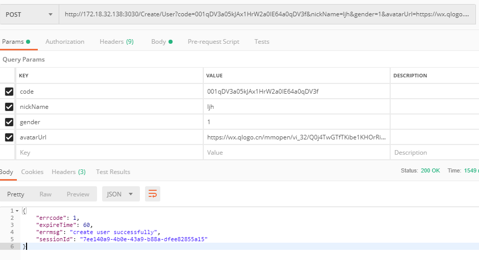

# 登陆

http://172.18.32.138:3030/Create/Login

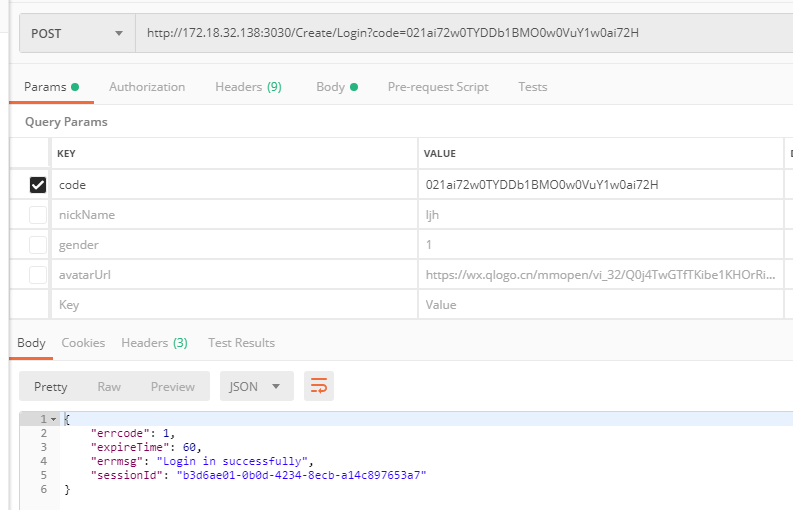

# 创建代购/求购

http://172.18.32.138:3030/Create/Gou

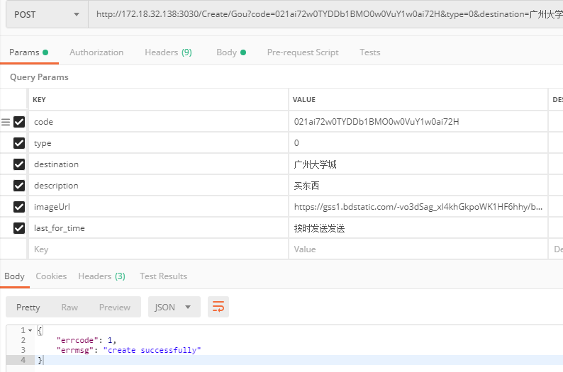

# 创建子订单

http://172.18.32.138:3030/Create/SubGou

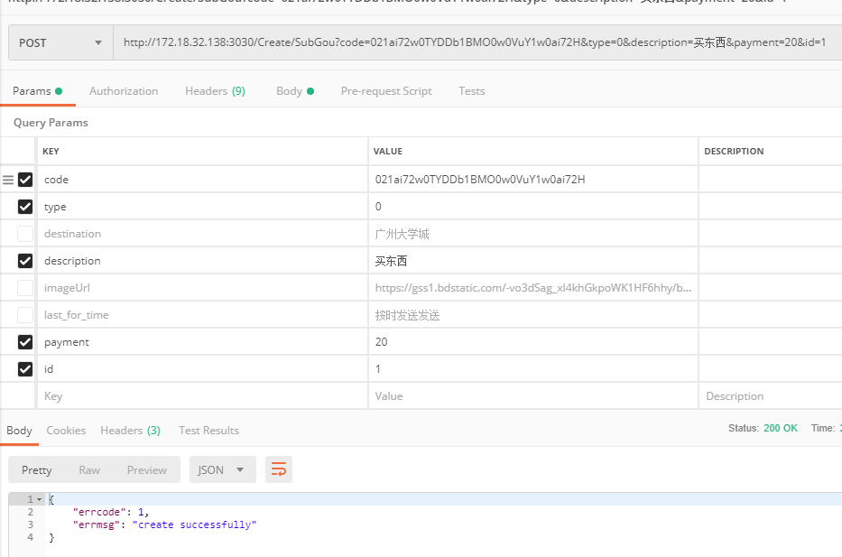

# 加载订单

http://172.18.32.138:3030/Create/onLoad

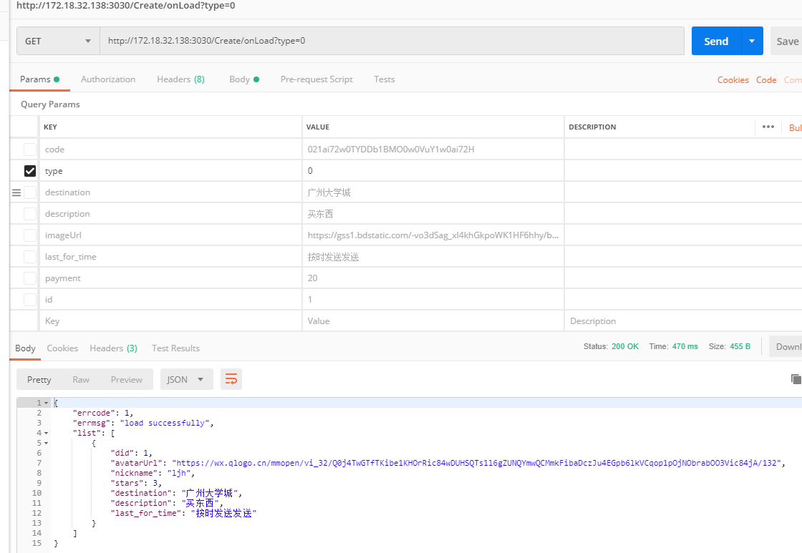

# 上拉加载子订单

http://172.18.32.138:3030/Create/downLoad

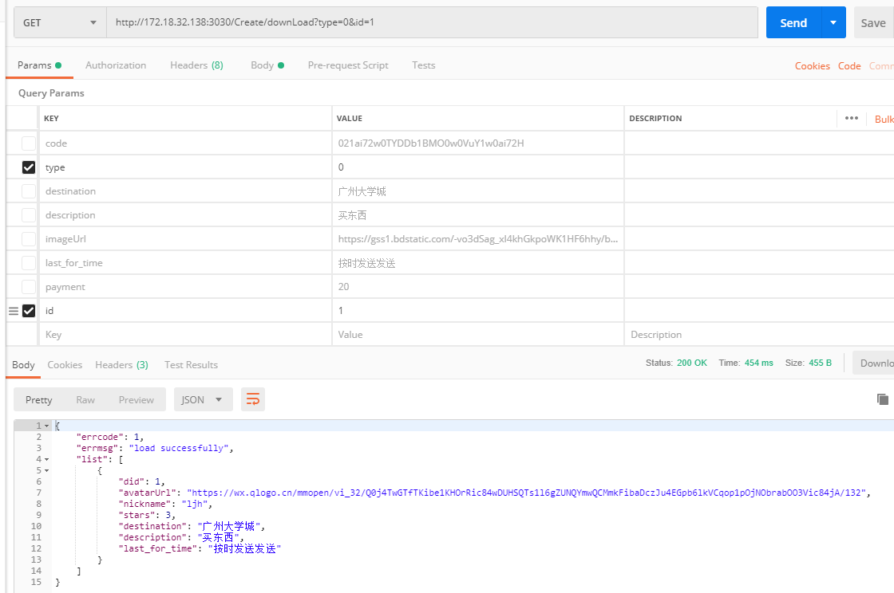

# 加载子订单

http://172.18.32.138:3030/Create/onShow

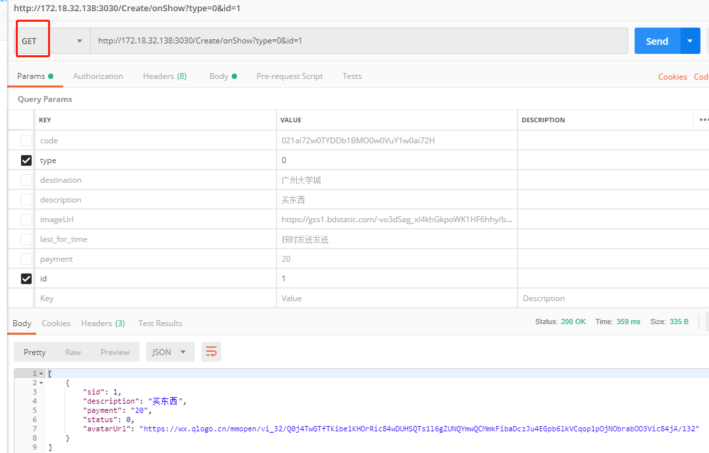

# 订单详情

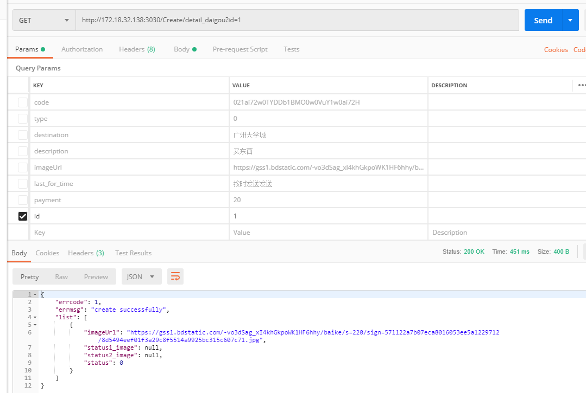

# 接受订单 

http://172.18.32.138:3030/Create/ReceiveGou

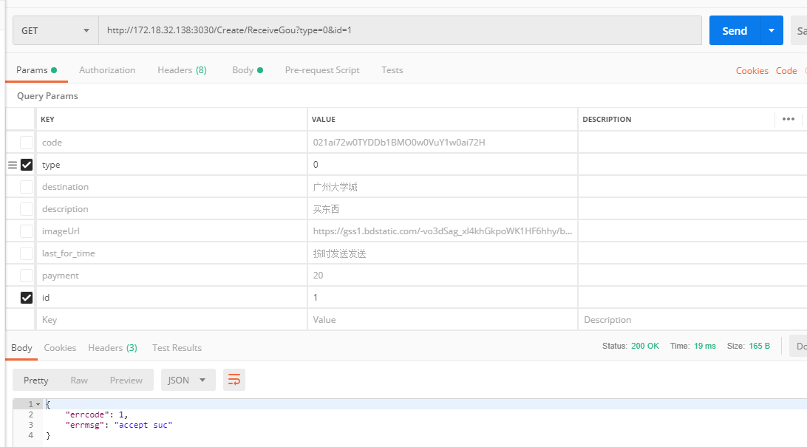

# 接受子订单

http://172.18.32.138:3030/Create/ReceiveSubGou

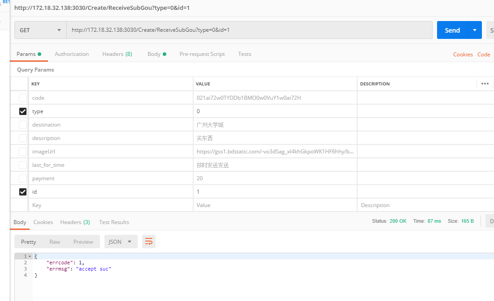

# 改变状态

http://172.18.32.138:3030/Create/ChangeStatues

状态2-3，4-5不需要 “imageUrl",但前端需要传一个空串

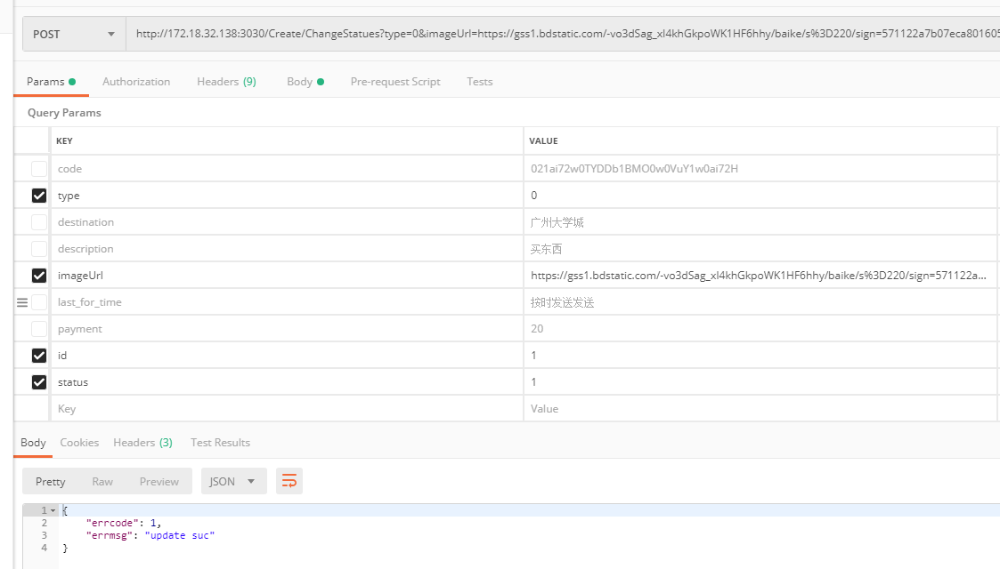

# 确认（结束）订单并评价

http://172.18.32.138:3030/Create/FinishSubgou

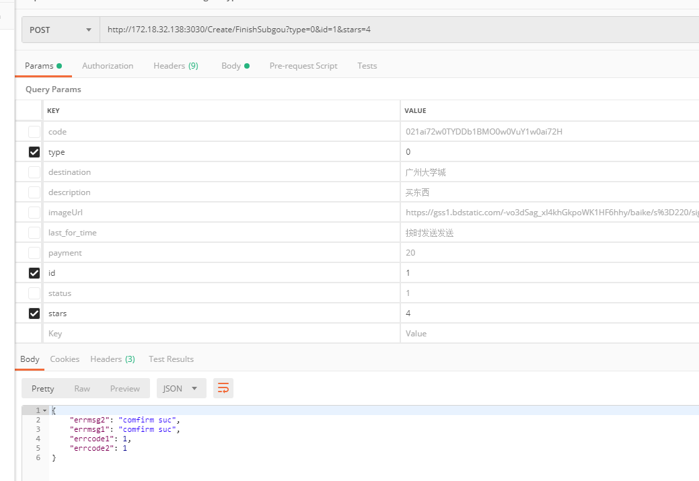

