# 用户手册

## 注册 

- 选择学校后点击注册

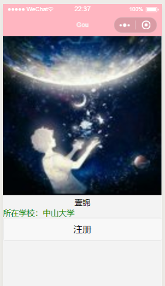

## 代购/求购 首页

- 点击 “代购”/“求购”切换查看消息
- 点击 “+” 创建“代购”/“求购”消息
- 点击对应的消息可以查看详情
- 查看消息最下面可获知旅游地点
- 查看星星可获知用户评价

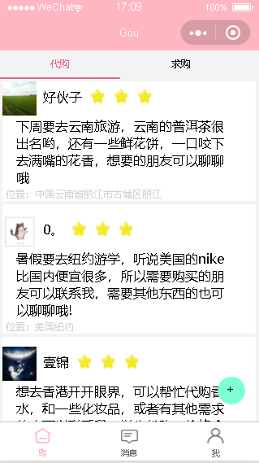

## 消息页面

- 点击消息可查看详情
- 点击完成可结束订单并评价

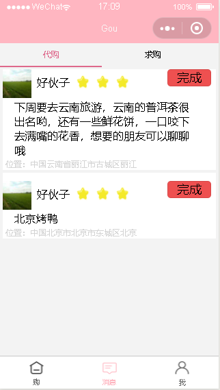

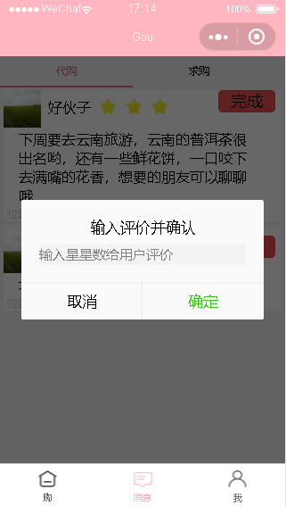

## 个人信息页面

- Information 可查看个人信息
- Servicer 联系客服

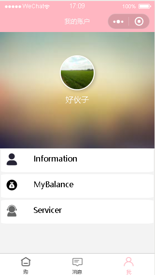

## 订单详情

- 图片是景点的一些说明，可用于丰富用户的描述，吸引购买者

- 更新行程可更新“购主”的行程，便于购买者获知订单进展，其中在启程和返回阶段需要上传“购主”的车票，便于证实其旅行的真实性和产品的真实性

- “+” 可创建“一起购”，即购买者对该订单感兴趣，可以添加“一起购订单”

  

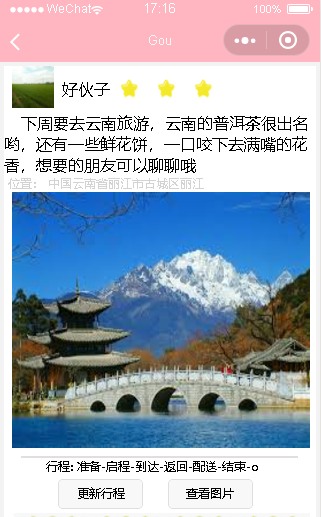

- 用户可通过查看图片来查看"购主"的旅行真实性

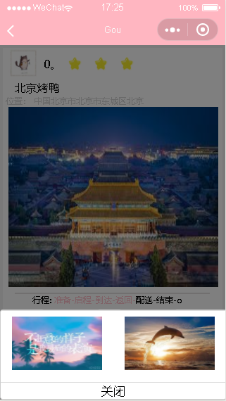

- 联系方式做了防泄露处理，即与该订单无关的人员无法获取任何相关人的联系方式，保护用户的隐私，防止有人获取联系方式，对用户进行电信骚扰

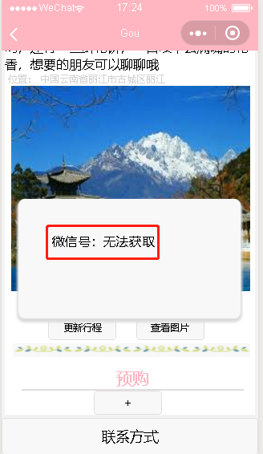

## 创建页面

- 创建代购/求购

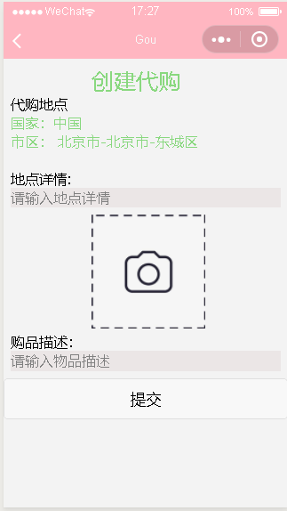

- 地点以“轮选”方式进行选择

  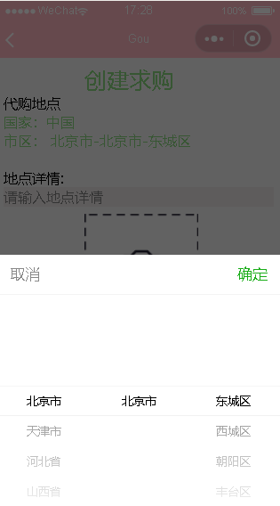

- 创建 一起购

  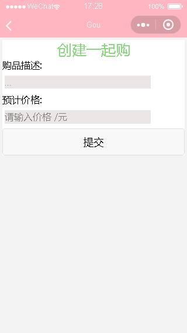

  